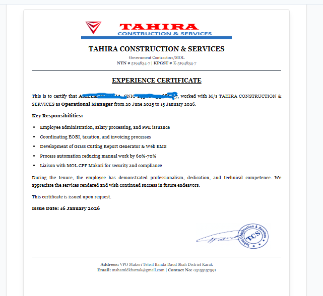
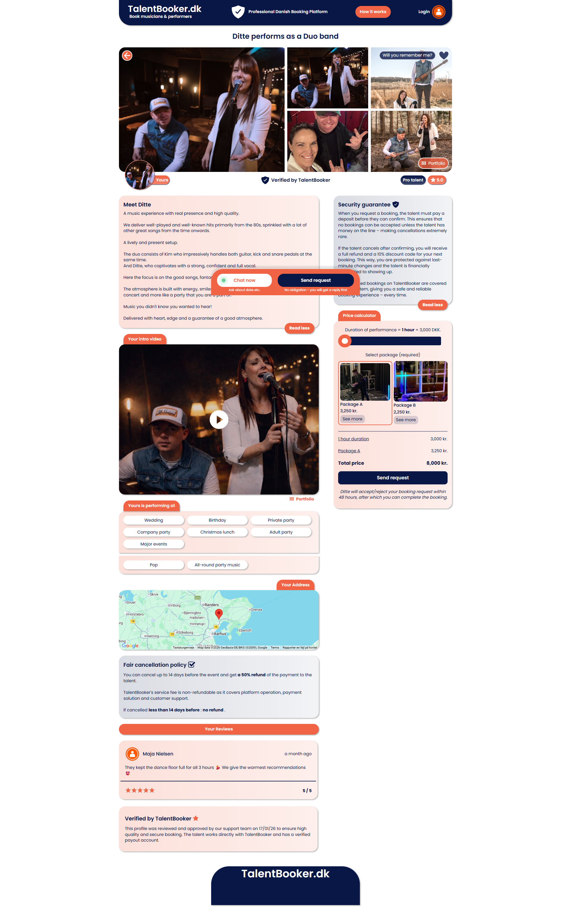

<h1 align="center">🚀 AI, Full Stack & Automation Project Showcase</h1>

<p align="center">
A curated collection of AI-powered systems, MERN stack applications, no-code platforms, workflow automations, and modern digital product solutions.
</p>

---

# 📌 About This Repository

This repository showcases a collection of real-world projects, workflows, and application interfaces focused on:

- Artificial Intelligence
- Full Stack Development
- No-Code Platforms
- Business Automation
- Workflow Management
- Ecommerce AI Assistants
- Video Generation Systems

Each project folder contains visual assets, UI previews, workflow diagrams, and system showcases demonstrating architecture, features, and product capabilities.

---

# 📂 Repository Structure

```bash
assets/
│
├── mern-project/
├── no-code/
├── novacart/
├── scrum-workflow/
└── video-generation/
```

---

# 🧠 MERN Project — Employee Management System (EMS)

<p align="center">
  <a href="https://tahira-ems.base44.app">
    
  </a>
</p>


## 📖 Overview

A complete enterprise-grade Employee Management System designed to digitalize and automate business operations, reducing more than 80% of manual administrative work.

The platform centralizes employee operations into a single scalable web application, enabling organizations to efficiently manage workforce activities, records, payroll, attendance, reporting, and internal workflows.

---

## ✨ Key Features

- Employee Records Management
- Department Management
- Attendance Tracking System
- Salary & Payroll Management
- Invoice Management
- Annual Bonus Management
- Experience Certificate Generation
- Grass Cutting Report Module
- Role-Based Access Control
- Admin / Editor / Viewer Permissions
- Workflow & Settings Management
- Fully Responsive Dashboard
- Modern UI/UX Experience

---

## 🖼️ System Preview

### Dashboard & Cover

| Dashboard | Overview |
|---|---|
|  |  |

---

### Employee & Department Management

| Employees | Departments |
|---|---|
|  |  |

---

### Attendance & Payroll

| Attendance | Salaries |
|---|---|
|  |  |

---

### Invoices & Certificates

| Invoices | Experience Certificates |
|---|---|
|  |  |

---

## ⚙️ Highlights

- Streamlines HR operations
- Reduces paperwork and repetitive tasks
- Improves workforce tracking and transparency
- Scalable architecture for organizations
- Centralized management system

---

# 💡 No-Code Project — TalentBooker

<p align="center">

</p>

## 📖 Overview

TalentBooker is a fully responsive no-code application built using Bubble.io, designed to simplify talent management, bookings, and digital workflows through a modern and scalable platform.

The system demonstrates how powerful production-ready applications can be developed rapidly using no-code technologies while maintaining professional UI/UX standards and responsive experiences.

---

## ✨ Features

- Fully Responsive Design
- Modern UI Components
- Dynamic Workflows
- User-Friendly Interface
- Mobile Optimized Experience
- Scalable No-Code Architecture
- Interactive Pages & Components

---

## 🖼️ Application Preview

| Home Page | Dashboard |
|---|---|
|  |  |

---

| Mobile Responsive | User Interface |
|---|---|
|  |  |

---

## ⚡ Built With

- Bubble.io
- No-Code Workflows
- Responsive UI/UX Design
- Automation Logic

---

# 🤖 NovaCart — AI Shopping Assistant

<p align="center">

</p>

## 📖 Overview

NovaCart is an AI-powered ecommerce assistant that combines conversational AI, semantic product search, and intelligent recommendations into a modern shopping experience.

The chatbot helps users discover products naturally using conversational interactions while supporting advanced ecommerce actions such as order placement, tracking, product comparisons, and personalized recommendations.

---

## 🧠 AI Capabilities

- AI Chatbot Integration
- Natural Language Product Search
- Budget-Based Recommendations
- Smart Product Comparisons
- Add to Cart Functionality
- Place & Cancel Orders
- Order Tracking
- Product Suggestions
- Chat History & Memory
- Intent Detection
- AI Shopping Assistance

---

## 🔍 Smart Ecommerce Features

- Semantic Product Search
- AI-Powered Recommendations
- Conversational Shopping Experience
- Personalized Responses
- Context-Aware Conversations
- Product Discovery Automation
- Intelligent User Assistance

---

## 🖼️ System Showcase

| AI Chat Interface | Product Recommendations |
|---|---|
|  |  |

---

| Product Comparison | Shopping Workflow |
|---|---|
|  |  |

---

## ⚙️ Technologies & Concepts

- OpenAI GPT
- AI Chatbot Systems
- Conversational AI
- Semantic Search
- Vector Embeddings
- Prompt Engineering
- Ecommerce Automation
- AI Recommendation Systems

---

# 📊 Scrum Workflow

<p align="center">

</p>

## 📖 Overview

A visual representation of a complete Scrum and Agile workflow designed to improve collaboration, sprint planning, project management, and development execution.

The workflow demonstrates how tasks move through the development lifecycle while maintaining transparency, productivity, and team coordination.

---

## 📌 Workflow Includes

- Sprint Planning
- Task Lifecycle
- Agile Process Flow
- Backlog Management
- Team Collaboration
- Development Workflow
- Scrum Execution Model

---

## 🖼️ Workflow Preview


---

# 🎬 Video Generation System

<p align="center">

</p>

## 📖 Overview

An AI-driven video generation workflow showcasing how automated systems can generate, process, and manage video content using modern AI pipelines and creative automation techniques.

The project demonstrates workflow architecture, generation stages, and automation concepts used in AI video production systems.

---

## ✨ Features

- AI Video Generation Workflow
- Automated Content Pipeline
- Visual Generation Stages
- AI Processing Architecture
- Creative Automation Flow
- Modern Production Workflow

---

## 🖼️ Workflow Showcase

| Generation Flow | Processing Pipeline |
|---|---|
|  |  |

---

# 🛠️ Technologies & Concepts

- Artificial Intelligence
- MERN Stack
- Bubble.io
- Conversational AI
- Semantic Search
- RAG Architecture
- Workflow Automation
- Ecommerce Systems
- Agile Methodologies
- Video Generation Pipelines

---

# 📌 Notes

- All assets and visuals are shared for portfolio and showcase purposes.
- Some projects may contain UI previews, workflow diagrams, and concept demonstrations.
- Public repository intended for educational and professional showcasing.

---

# 📬 Contact & Portfolio

For collaborations, demos, or project inquiries:

- GitHub Profile
- Upwork Portfolio
- Google Drive Assets
- LinkedIn

---
```