<h1 align="center">Selected Projects & Systems</h1>

<p align="center">
Collection of product systems, workflows, dashboards, automation concepts, and application interfaces across AI, ecommerce, no-code, and full stack development.
</p>

---

# About This Repository

This repository contains a collection of real-world projects, workflows, and product systems focused on business automation, ecommerce experiences, workflow management, and modern web applications.

The repository includes interface previews, workflow diagrams, dashboard systems, conversational assistants, and automation concepts built across different technologies and platforms.

---

# Repository Structure

```bash
assets/
│
├── mern-project/
├── no-code/
├── novacart/
├── scrum-workflow/
└── video-generation/
```

---

# Employee Management System (EMS)

> Status: Showcase Repository

<p align="center">
  <a href="https://tahira-ems.base44.app">
    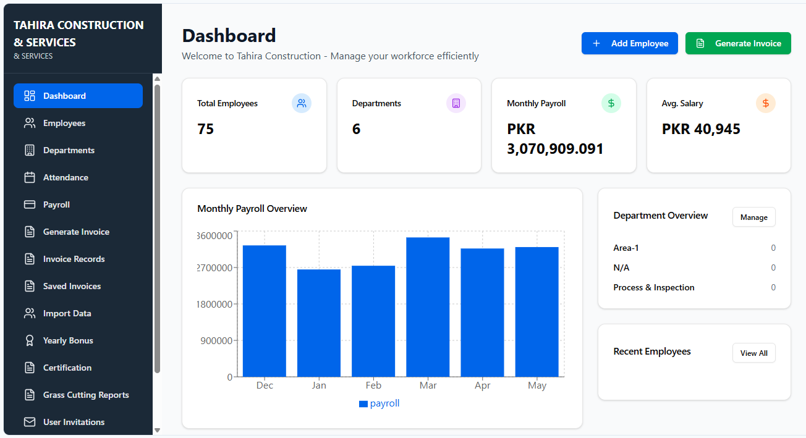
  </a>
</p>

## Overview

A centralized Employee Management System built to simplify daily HR and administrative operations through a modern web-based workflow.

The platform manages employees, departments, payroll, attendance, invoices, reporting, and internal permissions from a single dashboard while reducing repetitive manual processes across teams.

The system is designed to help organizations move from fragmented manual operations to a structured digital workflow with role-based access and centralized management.

---

## Live Preview

https://tahira-ems.base44.app

---

## Features

- Employee Records Management
- Department Management
- Attendance Tracking
- Payroll & Salary Management
- Invoice Management
- Annual Bonus Management
- Experience Certificate Generation
- Grass Cutting Report Module
- Role-Based Access Control
- Admin / Editor / Viewer Permissions
- Workflow Settings & Configuration
- Responsive Dashboard Interface
- Centralized Operational Management

---

## Voice Assistant Workflow

The Employee Management System also includes an interactive voice assistant workflow designed to help businesses evaluate and automate manual HR and payroll processes.

The voice agent interacts conversationally with users by asking operational questions such as:

- Whether payroll and HR tasks are currently handled manually
- Time spent managing attendance and employee records
- Administrative workload on HR teams
- Existing workflow bottlenecks
- Internal process inefficiencies

Based on user responses, the system provides workflow suggestions and operational recommendations tailored to organizational needs.


### Voice Samples
### Audio 1
https://github.com/HSDY-Tech/Porfolio/assets/mern-project/audio/Audio1.wav
### Audio 2
https://github.com/HSDY-Tech/Porfolio/assets/mern-project/audio/Audio2.wav
### Audio 3
https://github.com/HSDY-Tech/Porfolio/assets/mern-project/audio/Audio3.wav
---

## Interface Preview

### Dashboard & Overview

| Dashboard | Overview |
|---|---|
|  | 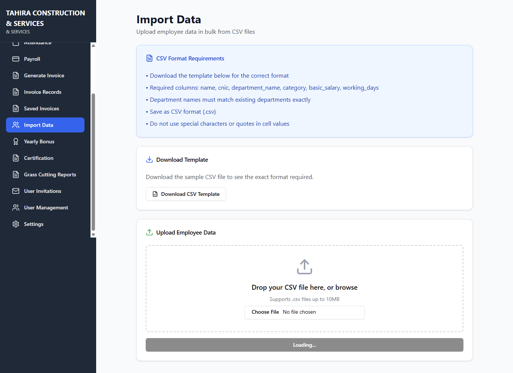 |

---

### Employee & Department Management

| Employees | Departments |
|---|---|
| 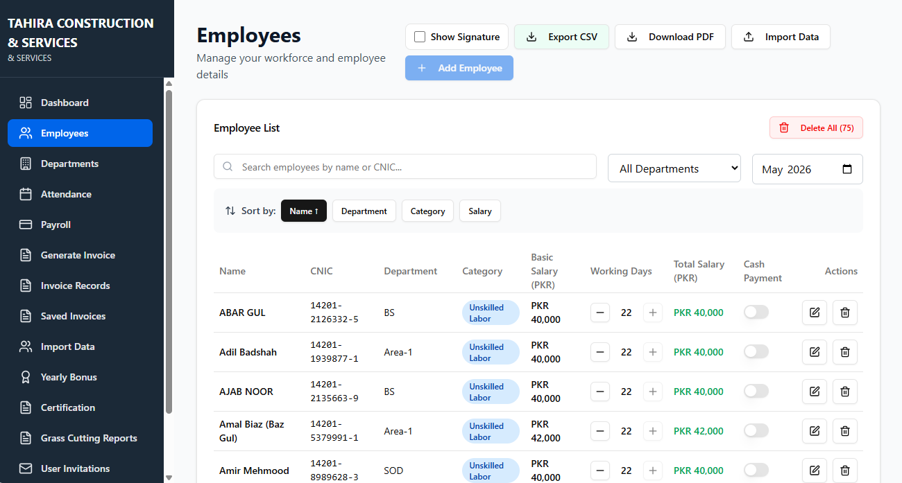 | 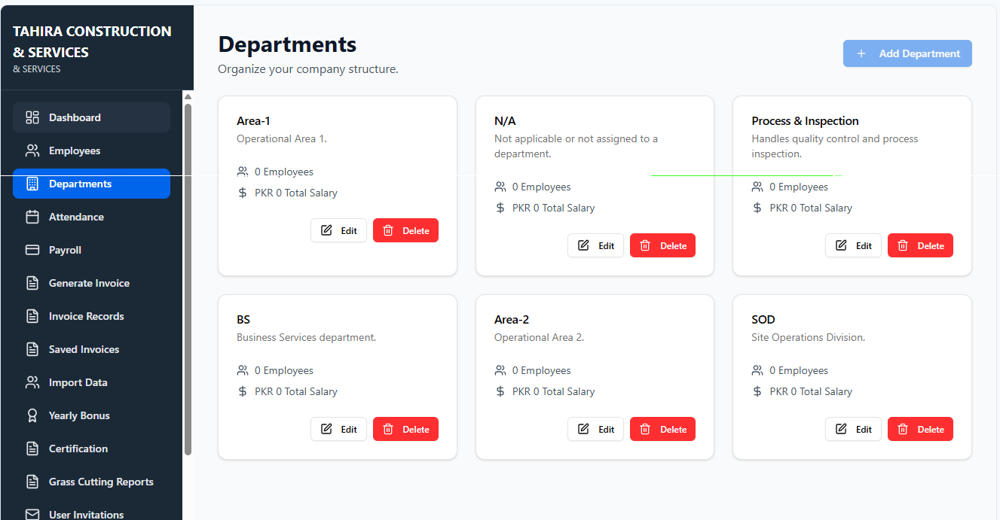 |

---

### Attendance & Payroll

| Attendance | Payroll |
|---|---|
| 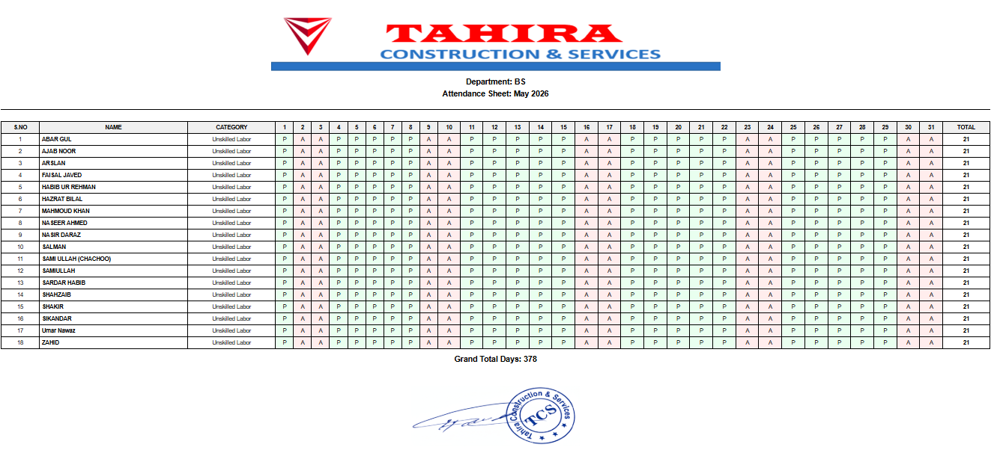 | 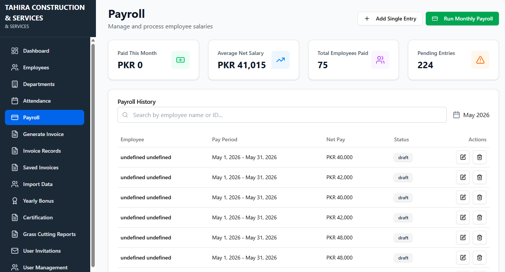 |

---

### Invoices & Certificates

| Invoices | Settings |
|---|---|
| 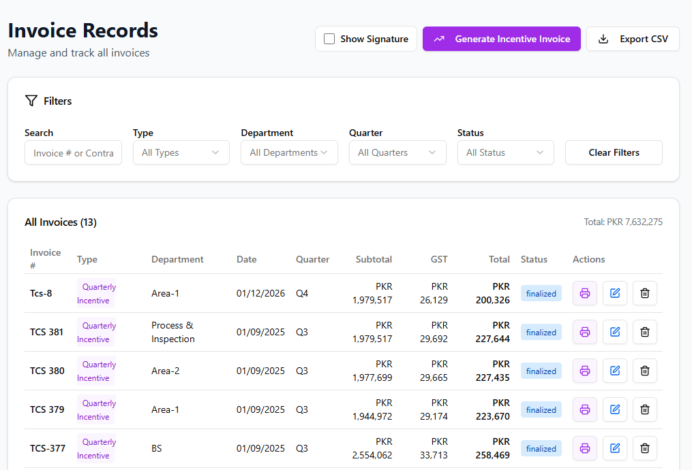 | 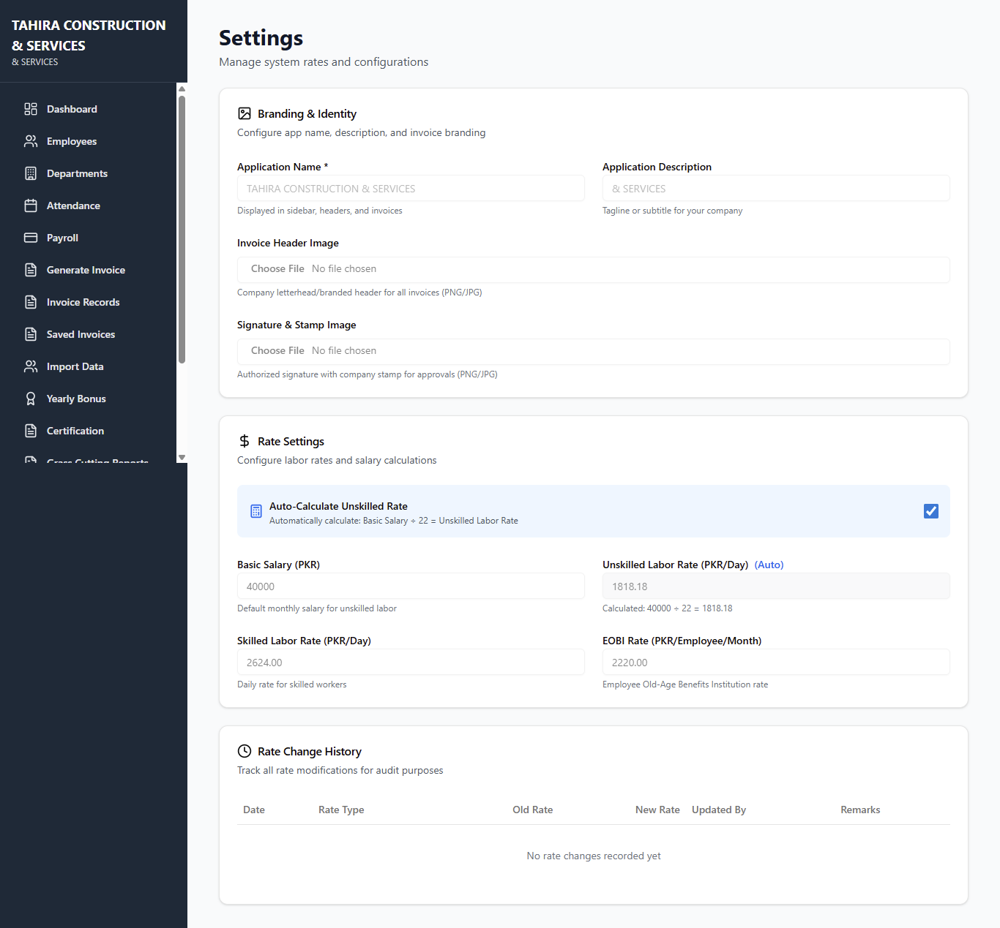 |

---

## Highlights

- Reduces repetitive administrative work
- Centralizes workforce operations
- Improves operational visibility
- Simplifies HR workflows
- Supports scalable organizational management

---

## Stack & Concepts

- MERN Stack
- Workflow Automation
- Role-Based Access
- Dashboard Systems
- Business Process Management
- Voice Workflow Integration

---

# TalentBooker — No-Code Platform

> Status: Showcase Repository

<p align="center">

</p>

## Overview

TalentBooker is a responsive no-code application built using Bubble.io, designed to streamline talent management, booking workflows, and user interactions through a modern interface.

The project demonstrates how scalable and production-ready systems can be built rapidly using no-code technologies while maintaining responsive layouts and structured workflows.

---

## Features

- Fully Responsive Design
- Interactive User Interface
- Dynamic Workflows
- Mobile Optimized Experience
- Scalable No-Code Architecture
- Modern Dashboard Components
- Structured User Flows

---

## Interface Preview

| Home Page | Dashboard |
|---|---|
|  | 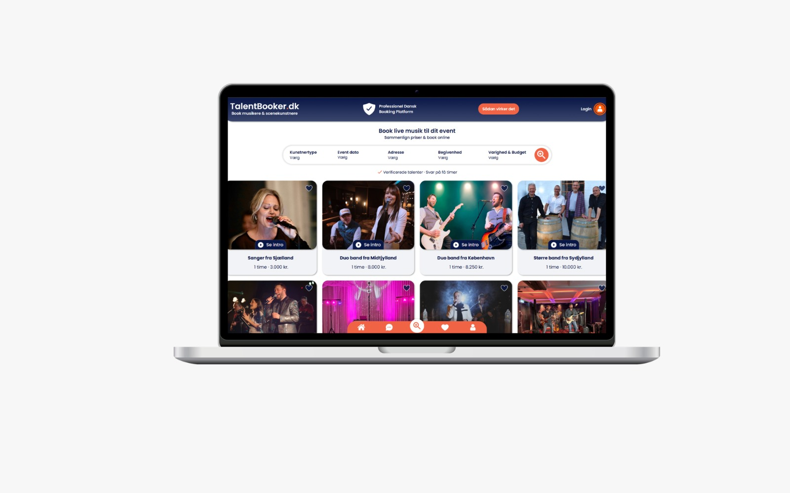 |

---

| Mobile Responsive | User Interface |
|---|---|
|  |  |

---

## Stack & Concepts

- Bubble.io
- No-Code Development
- Workflow Automation
- Responsive UI/UX
- Dynamic Interfaces

---

# NovaCart — Ecommerce Shopping Assistant

> Status: Showcase Repository

<p align="center">
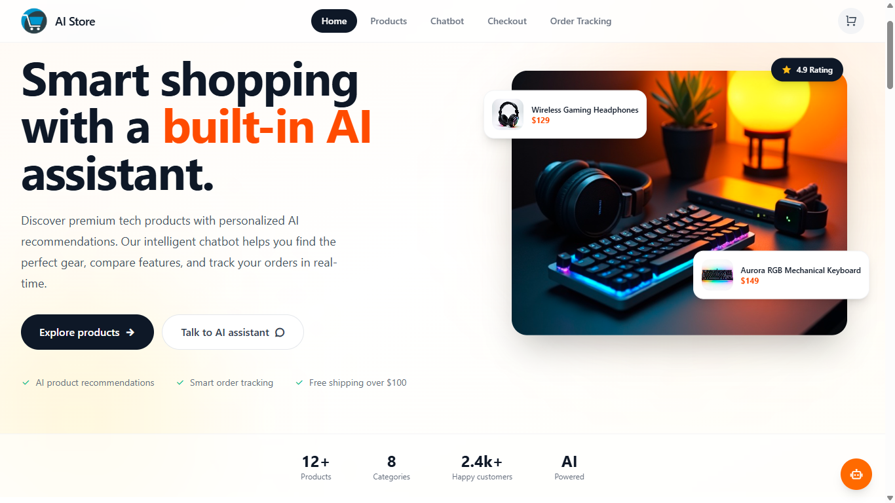
</p>

## Overview

NovaCart is a conversational ecommerce assistant designed to help users discover products naturally through chat-based interactions.

The system supports product search, comparisons, budget-based recommendations, order management, and personalized shopping assistance inside a single conversational interface.

The assistant is built around contextual conversations that help users navigate ecommerce experiences more efficiently while simplifying product discovery and order handling.

---

## Features

- Conversational Product Search
- Budget-Based Recommendations
- Product Comparisons
- Add to Cart Workflow
- Place & Cancel Orders
- Order Tracking
- Personalized Suggestions
- Chat History & Session Context
- Conversational Shopping Interface

---

## Ecommerce Capabilities

- Product Discovery
- Context-Aware Recommendations
- Conversational Navigation
- Smart Filtering
- Shopping Assistance
- Order Management Workflow

---

## Interface Preview

| Chat Interface | Product Recommendations |
|---|---|
| 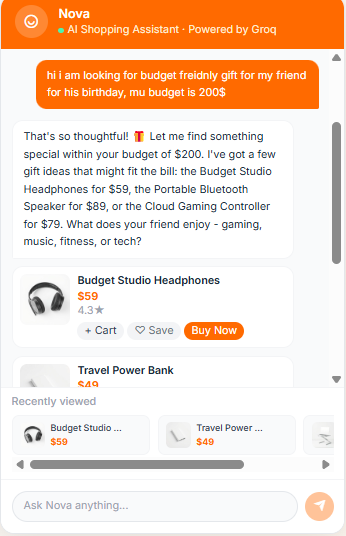 | 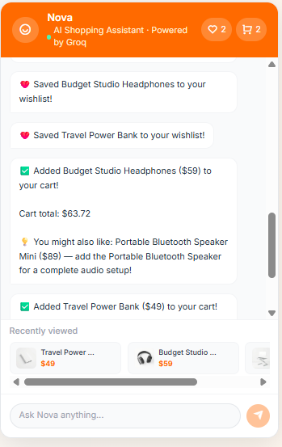 |

---

| Product Comparison | Shopping Workflow |
|---|---|
| 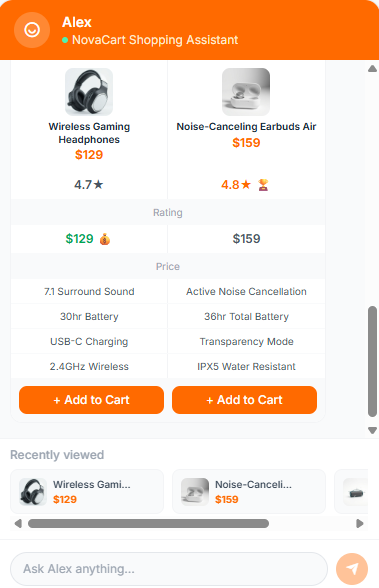 | 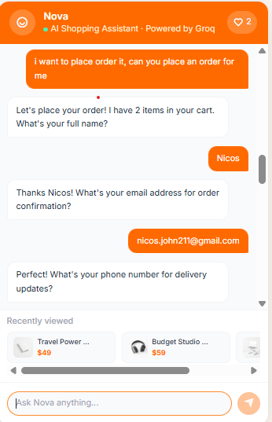 |

---

## Stack & Concepts

- OpenAI
- Next.js
- RAG
- Vector Search
- Semantic Search
- Prompt Engineering
- Conversational Interfaces

---

# Scrum Workflow

> Status: Showcase Repository

<p align="center">
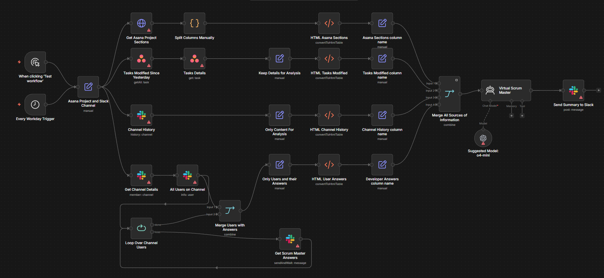
</p>

## Overview

A visual representation of a Scrum and Agile workflow designed to improve project coordination, sprint execution, and development management.

The workflow demonstrates how tasks move through planning, development, review, and deployment stages while maintaining collaboration and operational visibility across teams.

---

## Workflow Includes

- Sprint Planning
- Task Lifecycle Management
- Agile Development Flow
- Backlog Management
- Team Collaboration
- Development Process Visualization
- Scrum Execution Workflow

---

## Workflow Preview


---

# Video Generation System

> Status: Showcase Repository

<p align="center">
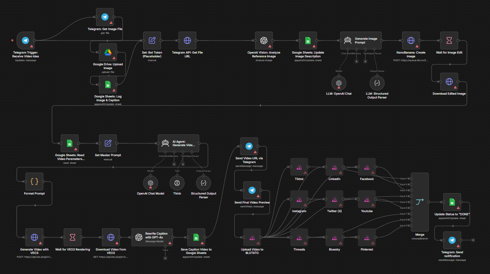
</p>

## Overview

A video generation workflow showcasing automated content generation pipelines, processing stages, and production concepts used in modern AI-assisted media systems.

The project focuses on workflow visualization, generation stages, and structured automation pipelines for creative production environments.

---

## Features

- Automated Video Workflow
- Content Processing Pipeline
- Generation Stages Visualization
- Workflow Automation
- Creative Production Concepts
- Media Processing Architecture

---

## Workflow Showcase


---

## Stack & Concepts

- Video Generation Pipelines
- Workflow Automation
- Processing Systems
- Creative Production Workflow
- AI-Assisted Media Systems

---

# Technologies & Concepts Across Projects

- MERN Stack
- Bubble.io
- Workflow Automation
- Conversational Interfaces
- Semantic Search
- RAG Architecture
- Dashboard Systems
- Ecommerce Workflows
- Agile Methodologies
- Voice Workflow Systems
- Video Processing Pipelines

---

# Notes

- All assets and visuals are shared for portfolio and showcase purposes.
- Some projects contain interface previews, workflow diagrams, and product demonstrations.
- Repository intended for educational, presentation, and professional showcase use.

---

# Contact & Portfolio

For collaborations, demos, or project inquiries:

- Upwork Portfolio
https://www.upwork.com/freelancers/~01fa29d991b431ec76
- LinkedIn
https://www.linkedin.com/company/hsdy-official/

---
